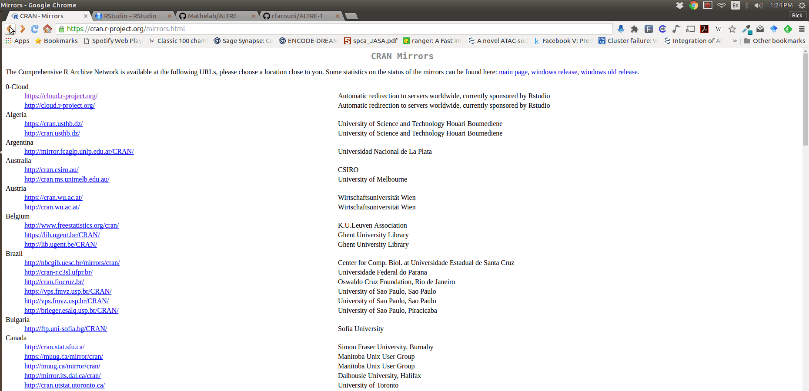
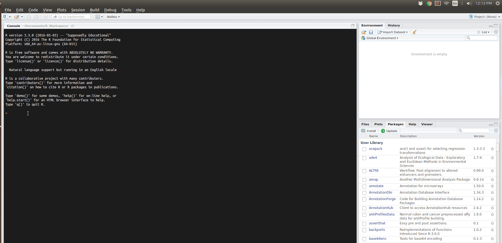

# ALTRE R Package

## Install From Github

```{R}

install.packages("devtools")               
# install Bioconductor packages
source("http://bioconductor.org/biocLite.R")
BiocInstaller::biocLite(c('GenomeInfoDb',
                        'IRanges',
                        'DESeq2',
                        'GenomicAlignments',
                        'SummarizedExperiment',
                        'GenomicRanges',
                        'Rsamtools',
                        'org.Hs.eg.db',
                        'clusterProfiler',
                        'ensembldb', 
                        'EnsDb.Hsapiens.v75',
                        'GO.db'))
# install the package
devtools::install_github("mathelab/ALTRE")
```
When installing on Linux, if you get an rJava package installation error. Please run the following two lines in the console:

```{R}
sudo apt-get install openjdk-7-*
sudo R CMD javareconf
```


On Windows, If you get an error then first run the following lines of code in as well:

```{R}
install.packages(c("htmltools","httpuv","evaluate","markdown"))
```


#### Installation Walk-through Animation




### To Run

To launch the Shiny app inside R, run

```{R}
library(ALTRE)
runShinyApp()
```
#### Shiny App Preview




## Data

A restricted subset of the data with one chromosome (i.e. chromosome 21) can be found on this [page](http://mathelab.github.io/ALTREsampledata/). The corresponding CSV file for input into ALTRE can be downloaded [here](https://raw.githubusercontent.com/mathelab/ALTREsampledata/master/DNaseEncodeWindows.csv). Be sure to modify the datapath column of the CSV file so that the appropriate full path of the data files on your local machine is included.

To download the entire data, please use a file download manager to download the files from the links listed below. 

### Alignment (in BAM format) files:

#### *A549*:
https://www.encodeproject.org/files/ENCFF001CLE/@@download/ENCFF001CLE.bam

https://www.encodeproject.org/files/ENCFF001CLJ/@@download/ENCFF001CLJ.bam
 
#### *SAEC*:
https://www.encodeproject.org/files/ENCFF001EFI/@@download/ENCFF001EFI.bam

https://www.encodeproject.org/files/ENCFF001EFN/@@download/ENCFF001EFN.bam

### Peak/hotspot (in BED format) files:

#### *A549*: 
http://hgdownload.cse.ucsc.edu/goldenPath/hg19/encodeDCC/wgEncodeUwDnase/wgEncodeUwDnaseA549HotspotsRep1.broadPeak.gz

http://hgdownload.cse.ucsc.edu/goldenPath/hg19/encodeDCC/wgEncodeUwDnase/wgEncodeUwDnaseA549HotspotsRep2.broadPeak.gz


#### *SAEC*:
http://hgdownload.cse.ucsc.edu/goldenPath/hg19/encodeDCC/wgEncodeUwDnase/wgEncodeUwDnaseSaecHotspotsRep1.broadPeak.gz

http://hgdownload.cse.ucsc.edu/goldenPath/hg19/encodeDCC/wgEncodeUwDnase/wgEncodeUwDnaseSaecHotspotsRep2.broadPeak.gz


##  To build from source (Optional)

To inculde the vignette in the installation package run

```{R}
devtools::install(build_vignettes = TRUE)
```

Make sure that the *vignette.Rmd*file contains the following commands in the header:

```{R}
author: "...."
title: "ALTRE: vignette"
date: "`r Sys.Date()`"
output: pdf_document
vignette: >
  %\VignetteIndexEntry{ALTRE: vignette}
  %\VignetteEngine{knitr::rmarkdown}
  %\VignetteEncoding{UTF-8}
```


